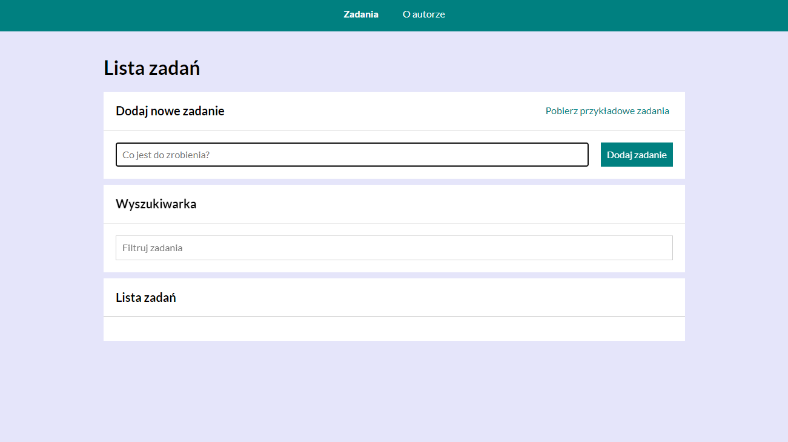

# Task-List

## Demo
https://dorotazielinska.github.io/task-list-react/

This application is easy to use, and already with interactions. The way off use is, please type in the first field ("Co jest do zrobienia?") what would you like to add to your task list, the next step is to
press button ("Dodaj zadanie") after that you will see bellow "Lista zadań" everything what you have added to your list. The green box you can use to mark that your task is done and red box is to remove your task from yours list.
Here are two buttons "Ukryj ukończone" you can use it if you wants to hide tasks which are done. The second button "Ukończ wszystkie" is marking all tasks as done.
After new update is a new button "Pobierz przykładowe zadania", you can use it to load examples of tasks which will apeer on your list "Lista zadań".
Another change is a link to your task, when you click on it you will be on another side of aplication with information about name of task and status of task "Ukończone:" done - "Yes" or undone - "No".
Also here is a page about Author, when you press on top of navigation on "O autorze" it will show a page with some short information about me.
In field "Wyszukiwarka" you can use it to search your list, to find what are you looking for on your list, by typing on field "Filtruj zadania" key words of your resarch.

## Description
This application I created as a homework of my programing cours at You Code, the main task was to remove old aplication task-list to library react and react-redux and redus.js/toolkit and to use redux-saga-effects.
The main prupose of that application is to make a list of tasks which would you like to do, to mark what you have done already and remove task from your list or to hide done tasks. Here are new pages about information of task and about Author of that aplication. Also field to resarch your list by key words.

## Technologies
- HTML
- CSS(grid,flex)
- JAVA SCRIPT(immutability)
- BEM convention
- Babel
- React hooks: useState, useRef
- React-Redux: Provider, useLocation, useHistory, searchParams
- React-Redux hooks: useSelector, useDispatch
- Styled Components, theme - ThemeProvider
- React-Saga-Effects: call, put, takeLatest, delay, takeEvery, select

# Getting Started with Create React App

This project was bootstrapped with [Create React App](https://github.com/facebook/create-react-app).

## Available Scripts

In the project directory, you can run:

### `npm start`

Runs the app in the development mode.\
Open [http://localhost:3000](http://localhost:3000) to view it in your browser.

The page will reload when you make changes.\
You may also see any lint errors in the console.

### `npm run build`

Builds the app for production to the `build` folder.\
It correctly bundles React in production mode and optimizes the build for the best performance.

The build is minified and the filenames include the hashes.\
Your app is ready to be deployed!

See the section about [deployment](https://facebook.github.io/create-react-app/docs/deployment) for more information.

### `npm run eject`

**Note: this is a one-way operation. Once you `eject`, you can't go back!**

If you aren't satisfied with the build tool and configuration choices, you can `eject` at any time. This command will remove the single build dependency from your project.

Instead, it will copy all the configuration files and the transitive dependencies (webpack, Babel, ESLint, etc) right into your project so you have full control over them. All of the commands except `eject` will still work, but they will point to the copied scripts so you can tweak them. At this point you're on your own.

You don't have to ever use `eject`. The curated feature set is suitable for small and middle deployments, and you shouldn't feel obligated to use this feature. However we understand that this tool wouldn't be useful if you couldn't customize it when you are ready for it.
